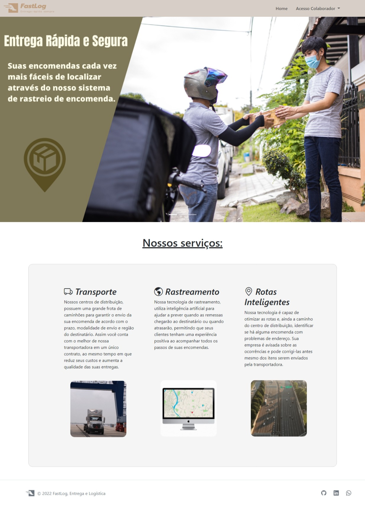
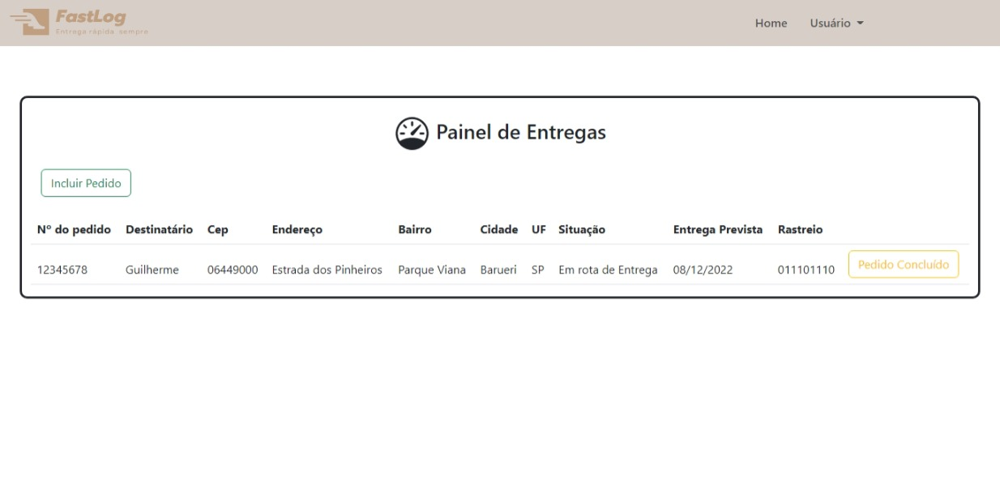

# Projeto FastLog

> Contexto: Criar um site com se fosse o de uma empresa de logística em que, o funcionário realiza o login acessando a interface de pedidos cadastrando entregas ou concluindo-as.

## 💻 Linguagens Utilizadas

* HTML
* CSS
* Bootstrap
* Java Script

## 📫 Contato

* Linkedin: https://www.linkedin.com/in/guilherme-mendes-do-nascimento-3b5325196/    
* Email: guilherme.mendes.15@hotmail.com 

[⬆ Voltar ao topo](#Projeto-FastLog) 
